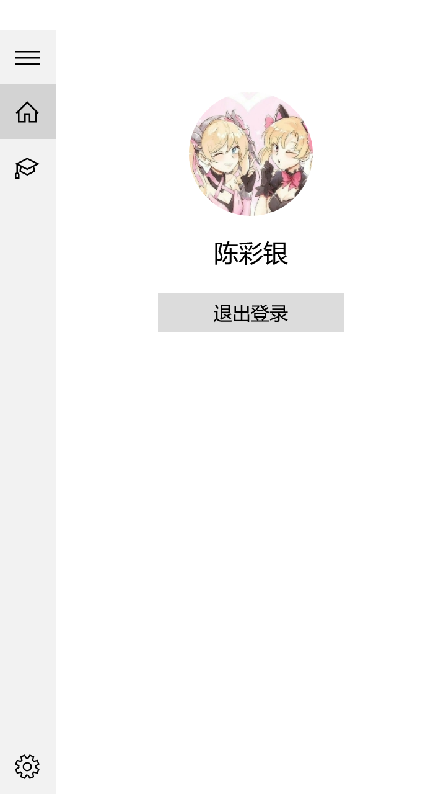
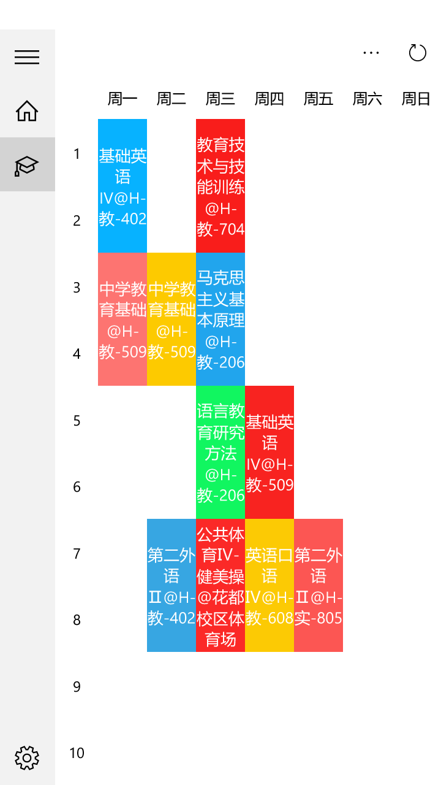
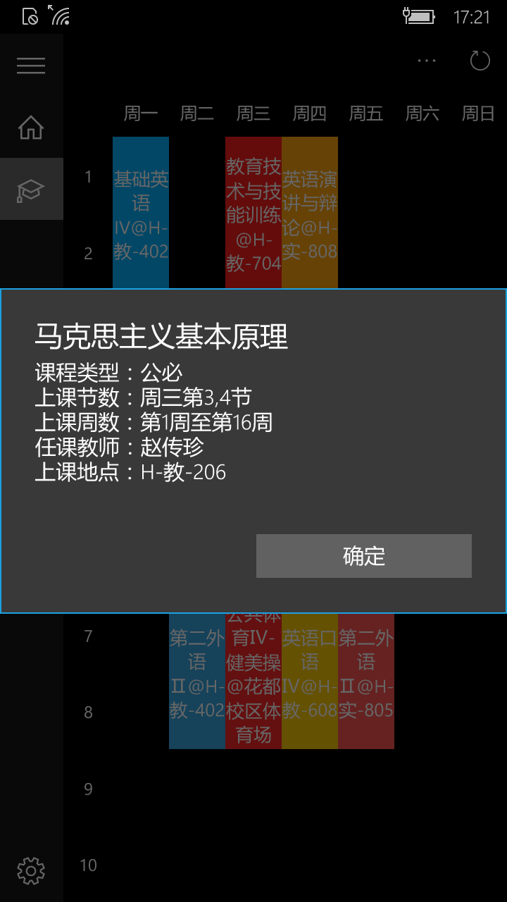

  

# 广东二师助手通用Windows版客户端

**广东第二师范学院校园助手系统通用Windows平台客户端应用**，最低兼容Windows 10（10.0；版本10240），支持Windows 10桌面版和移动版。应用目前提供了课表查询功能，支持切换深色主题。主要涉及网络和Web服务、JSON数据的解析和序列化、响应式布局设计和基础控件应用、凭据保险箱等技术。应用的后端API数据接口由广东第二师范学院校园助手系统提供。

## 功能

- 课表查询

## 预览

  
  
  

## 日志

- V1.0.1.0：修正课程表位置的错误
- V1.0.0.0：广东二师助手通用Windows客户端发布

## 链接
- [广东二师助手官网](https://gdeiassistant.cn)
- [Microsoft Store下载](https://www.microsoft.com/store/apps/9PCDF1P3CPMJ)

## 相关

广东二师助手通用Windows版客户端的后端API数据接口由[广东第二师范学院校园助手系统](https://github.com/SweetRadish/GdeiAssistant)提供

## 协议

[MIT](http://opensource.org/licenses/MIT)

Copyright (c) 2016 - 2019 GdeiAssistant

## 贡献

- 若你喜欢本项目，欢迎Star本项目

- 要贡献代码，欢迎Fork之后再提交[Pull Request](https://github.com/SweetRadish/GdeiAssistant-UWP/pulls)

- 如果你有好的意见或建议，欢迎给我们提交[Issue](https://github.com/SweetRadish/GdeiAssistant-UWP/issues)

## 联系

- 邮箱：[gdeiassistant@gmail.com](mailto:gdeiassistant@gmail.com)

## 声明

本项目只用作个人学习研究，如因使用本项目导致任何损失，本人概不负责。